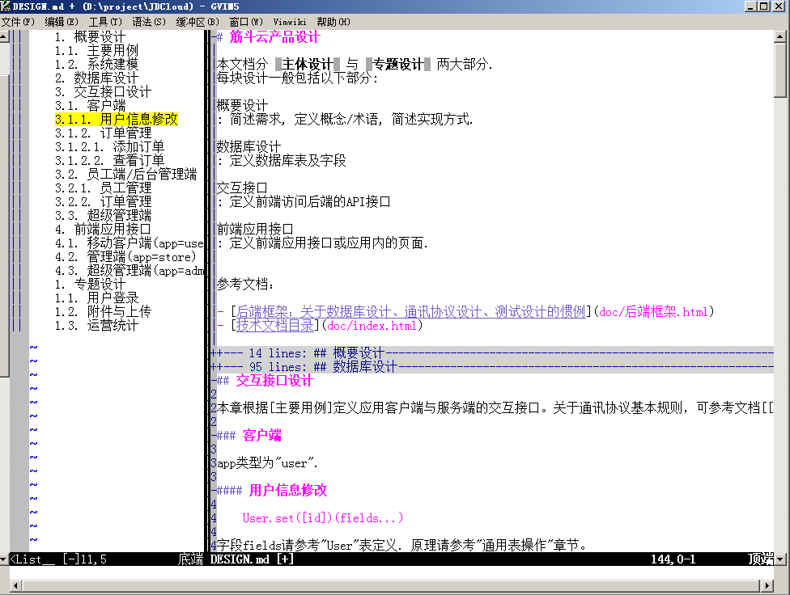
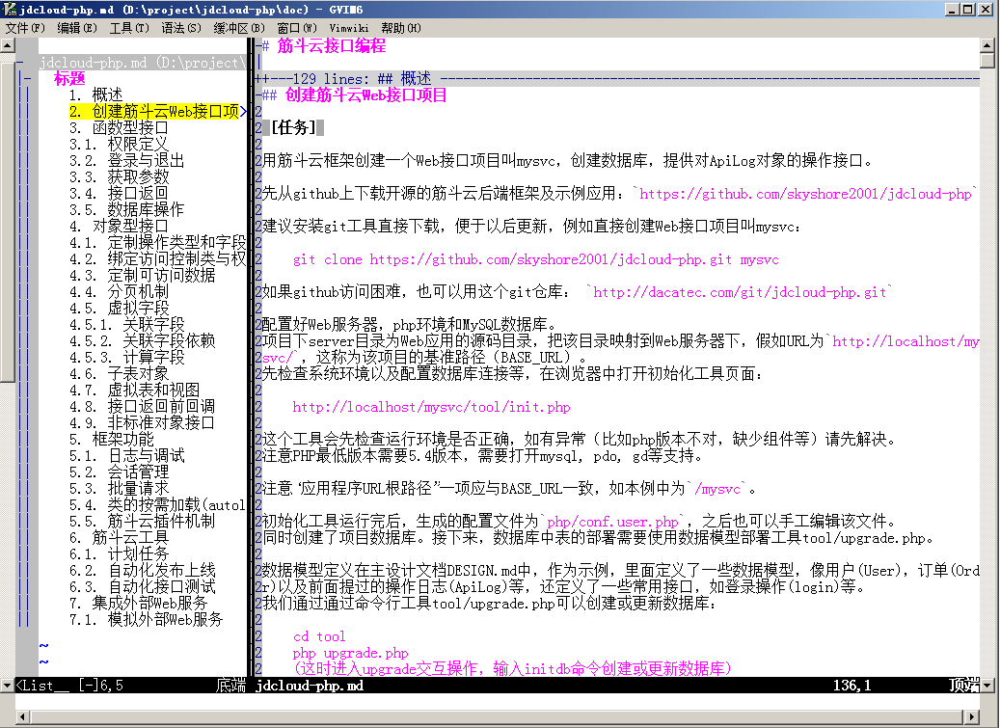
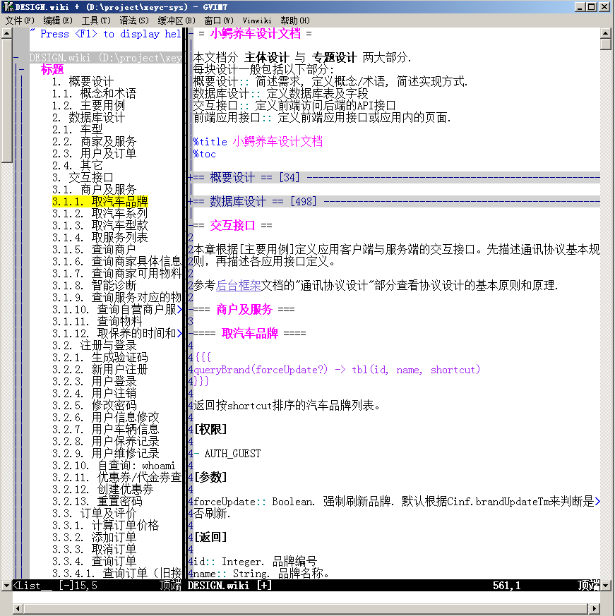

# vim支持markdown格式

## 概述

本方案支持：

- 语法高亮
- 层次折叠
- 大纲视图展示标题层次
- 结合pandoc工具生成文档预览

屏幕截图：

- 用vim+markdown写产品设计文档

	

- 用vim+markdown写教程

	

- 用vim+vimwiki写产品设计文档

	

本方案集成了taglist插件、vim8.0自带的markdown插件（有修改）、ctags扩展等组件，提供markdown编辑环境。
推荐再结合pandoc工具，可以生成html供预览。

## 安装

安装要求：

- vim 7+
- vim taglist插件: ref/taglist.vim，可复制到vimfiles/plugin目录下; ref/ctags.exe，复制到可执行路径下。
- perl 5.8+

安装：

- 复制vimfiles中的目录到vim插件目录。例如vim安装在`d:\vim`目录下，则一般插件目录为`d:\vim\vimfiles`。
- 将tool/ctags1.pl复制到可执行目录（假如复制到`d:\bat`为例，该目录已被加入系统缺省执行路径）

以下配置加入vim主配置文件（如`d:\vim\_vimrc`文件），注意修改 Tlist_Ctags_Cmd一行的文件路径：

	" 使用折叠
	let g:markdown_folding=1

	" markdown + taglist + ctags for markdown/vimwiki
	" !!! 修改这里的路径 !!!
	let Tlist_Ctags_Cmd="perl d:/bat/ctags1.pl"
	let tlist_markdown_settings="markdown;h:标题"
	let tlist_vimwiki_settings="wiki;h:标题"

	" for vimwiki
	let g:vimwiki_html_header_numbering=2
	let g:vimwiki_folding='expr'

建议再加入以下配置：

	" Ctrl-F11打开taglist
	nmap <silent> <C-F11> :TlistToggle<CR>

	" 用1列显示折叠情况
	set foldcolumn=1
	" 标识出隐藏内容
	if has('conceal')
		set conceallevel=1
		set concealcursor=n
	endif

注意：

- 如果原先已带markdown插件，请在ftplugin/syntax目录中删除（或改名）markdown.vim。

- 请检查.md文件是否默认关联到markdown格式。
 某些版本的vim中，"*.md"被关联到modula2文件类型，可打开vim目录下的filetype.vim，搜索"*.md"，如果未正确关联，就将它关联到markdown类型：

		" Markdown
		au BufNewFile,BufRead *.markdown,*.mdown,*.mkd,*.mkdn,*.mdwn,*.md setf markdown

		" Modula 2 (删除 *.md，如果有的话)
		au BufNewFile,BufRead *.m2,*.DEF,*.MOD,*.mi setf modula2

### 使用

- Ctrl-F11打开大纲视图（即Tag List）。可用回车或鼠标点击快速跳到指定章节。
- 在vim中用 za 来打开/关闭折叠，或用鼠标点击加号展开折叠。

vimwiki格式的使用类似。
要安装vimwiki，可找到 dep\vimwiki-lj-1.vmb 用vim打开它，再用 `:so %` 执行安装。

### 设置用pandoc生成html预览

markdown文档生成html可调用pandoc工具。请自行下载安装该工具。
一般可将 Makefile, style.css, tool/filter-md-html.pl 这几个文件复制到你的目录下，这样在vim中用下面命令生成html:

	:make %:r.html

具体命令可以参考Makefile中的设置。

过滤工具tool/filter-md-html.pl用于处理pandoc工具对标题章节号、生成目录处理的一些细节。
比如在文档的一开始用了一级标题当作文档标题，则pandoc生成章节号时会有问题（所有章节都是1.xx）。

此外，如果想简单直接地调用pandoc，不借助过滤工具，也可设置如下快捷键`\md`:

	nmap \md :!pandoc -f markdown -t html -s --toc -N -o %:r.html % <cr>

在查看文档时直接按快捷键即可生成html.

如果使用的是vimwiki，其插件支持用快捷键`\wh`生成文档或`\whh`生成或查看文档。

## 原理

**大纲视图显示原理**

TList插件默认使用ctags生成tag并显示在左侧窗口中。
为了支持markdown/vimwiki格式，本方案创建了tool/ctags1.pl 文件来处理这两种文档生成tag，对于其它类型文档，它调用ctags生成tag。

## 参考

- [vimwiki](https://github.com/skyshore2001/vimwiki-lj.git), 使用vim以wiki格式写文档.
- taglist, vim插件，用于显示源码中的tags，本项目用它显示文档大纲。
